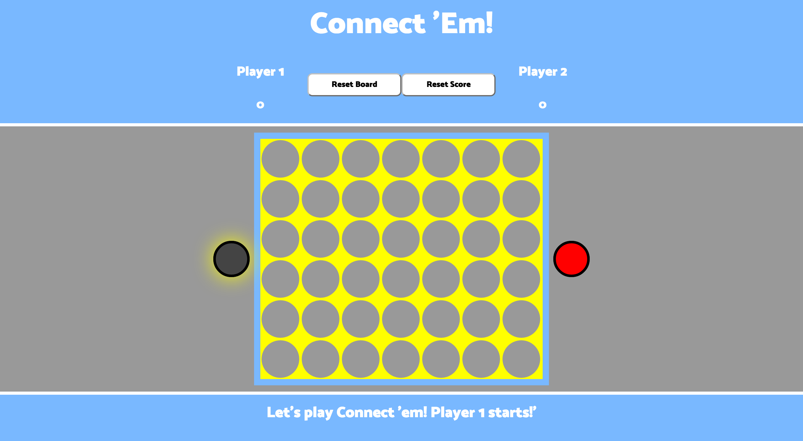
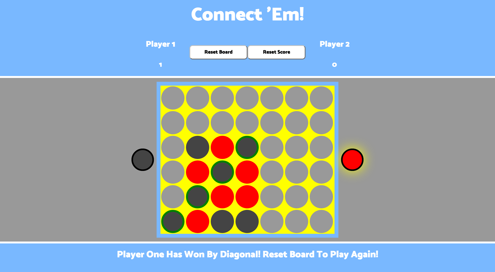

#**WD SM 23 Project 1**
--
#Project #1: **Connect 'Em!**
--
###A Game of Spatial Reasoning and Additive Real Estate Development
--

--
--
###Overview
--
The object of this game is to take turns placing chips in the game board with the goal of lining up four of your chips in any direction: vertically, horizontally, or diagonally.  

--
###Rules
--
Player One is assigned the color black and goes first to start. Players may only drop one chip per turn and must switch each turn until there is a winner or the entire game board is filled. Since the board is standing vertically, you may only place chips on the bottom or directly above another chip. Gravity **will** enforce this rule.

--
###Tech
--

               