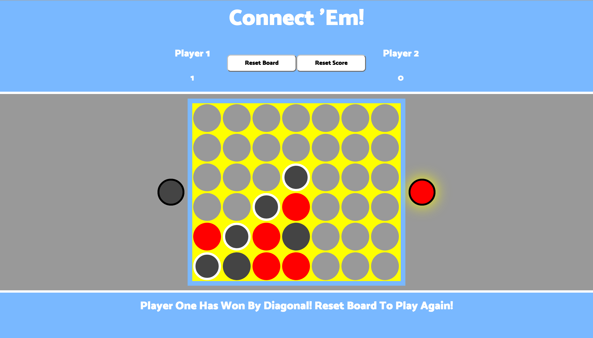

#**WD SM 23 Project 1**
--
#Project #1: **Connect 'Em!**
###A Game of Spatial Reasoning and Additive Real Estate Development
--

--
--
###Overview
--
The object of this game is to take turns placing chips in the game board with the goal of lining up four of your chips in any direction: vertically, horizontally, or diagonally.  

--
###How May I Play?
--
Either play it online [here](https://themichaelray.github.io/project-1) or fork the repository and open index.html in your browser! Keep in mind that the game works best on Chrome and you must be connected to the internet in order for the game to work properly.

--
###Rules
--
* Player One is assigned the color black and goes first to start.
* Players may only drop one chip per turn and must switch each turn until there is a winner or the entire game board is filled.
* Since the board is standing vertically, you may only place chips on the bottom or directly above another chip (i.e., gravity is in play)
* Drop a chip on the game board by either dragging and dropping your piece or clicking on the board itself

--
###User Stories
* As a user, I want to switch turns automatically when someone makes a valid move.
* As a user, I want to be able to visually see whose turn it is each time.
* As a user, I want to the pieces to fall like there is gravity.
* As a user, I want to be able to clearly see how a player won the game.
* As a user, I want to be able to easily play another round if I want to.

--
###Tech
--
* HTML
* CSS
* Javascript
* JQuery
* JQuery UI Plugin

--
###Resources Used
--
* JQuery API Documentation
* JQuery UI API Documentation

--
###Future Plans
* Single Player with Computer Moves
* Integrate smoother animations (chips bumping into each other on reset)
* CSS Masking/Clipping (simulates going between the sandwich boards)
* Strikethrough Animation for winning connects
* Multiple game size/mode options
* Sound Effects
* Blitz mode with integrated timer
* Mobile drag and drop
* Silhouette on mouse-over
* Undo button

--
###Known Bugs
--
* Redundancy in CSS.
* Gameboard breaks if the window is too small.
* Drag and drop does not work on mobile devices.
* Drag and drop helper clone does not work, uses identical placeholder div instead.
* Chips fall in front of the game board instead of behind it.
* Does not work as well on mobile or on IE.
